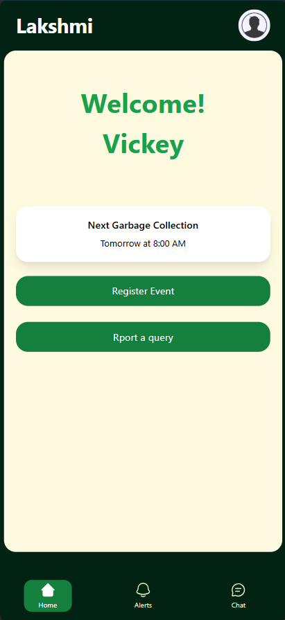
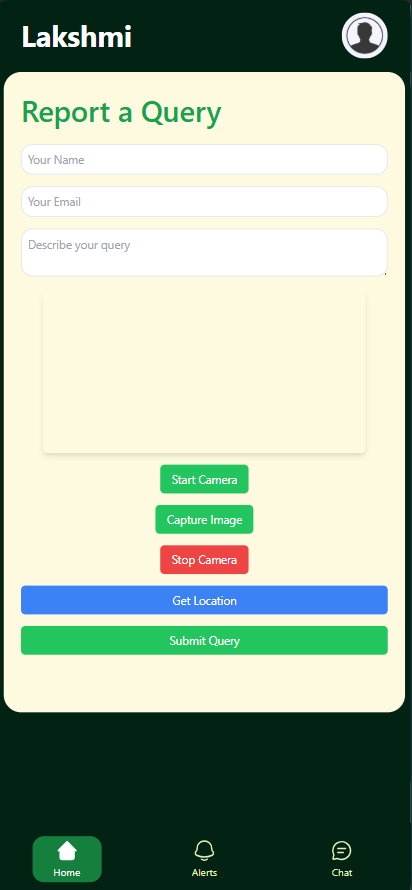
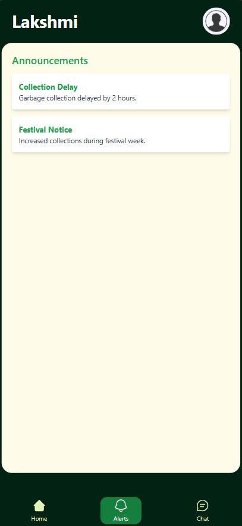

# Lakshmi - Smart Waste Management Client Panel

## Overview

Lakshmi is an intelligent waste management application that allows users to monitor waste collection, report issues, and receive important updates. The client-side application is a React-based web and mobile interface (PWA) for residents to interact with the system efficiently.

## Features

### 🗑 Live Waste Monitoring

- Users can check the real-time status of nearby dustbins.
- Helps in identifying overflowing bins and planning waste disposal accordingly.

### 📢 Announcements & Notifications

- Users receive real-time notifications from the admin panel.
- Important updates regarding waste collection schedules and alerts.

### 🚨 Complaint Registration

- Users can report overflowing dustbins directly through the app.
- Complaints are sent to the admin panel for quick resolution.

### 📅 Event Pre-Intimation

- Users can notify officials in advance about events that may generate extra waste.
- Helps in optimizing waste collection routes during special occasions.

### 🔔 User Dashboard

- Displays personal complaint history and responses.
- Provides a summary of waste management updates relevant to the user.

## Tech Stack

- **Frontend**: React.js PWA (Progressive Web Application),
- **Styling**: Tailwind CSS / Material-UI / Custom CSS
- **Database**: MongoDB

## Installation & Setup

```bash
# Clone the repository
git clone https://github.com/Vickeysvibe/Laks-app

# Navigate to the client panel folder
cd laks-app

# Install dependencies
npm install

# Start the development server
npm start
```

## Screenshots






<!--
## Demo Video

[](path-to-video/demo.mp4) -->

## Contribution

1. Fork the repository
2. Create a new branch (`feature-branch`)
3. Commit changes and push to your branch
4. Open a pull request

## License

This project is licensed under the MIT License.
