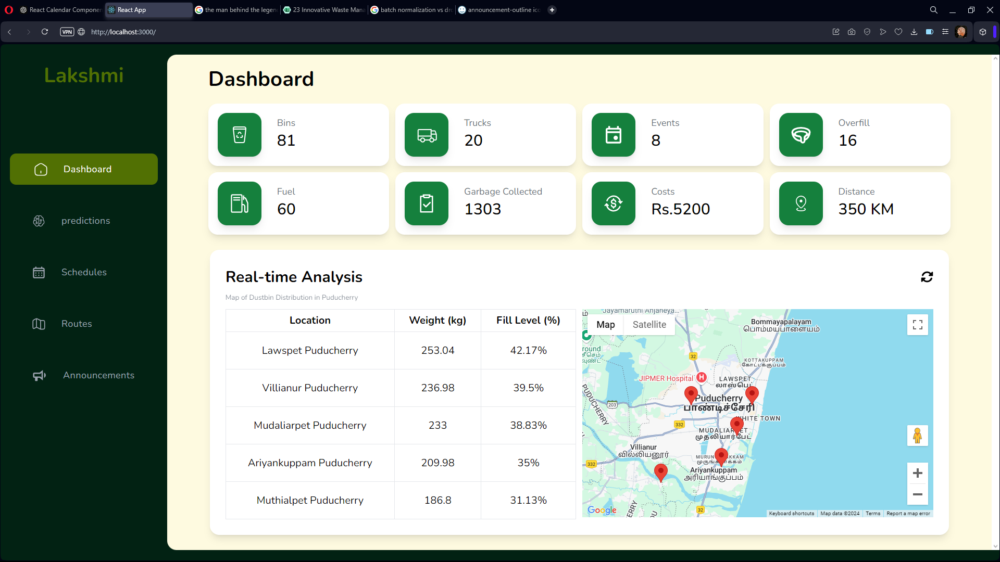
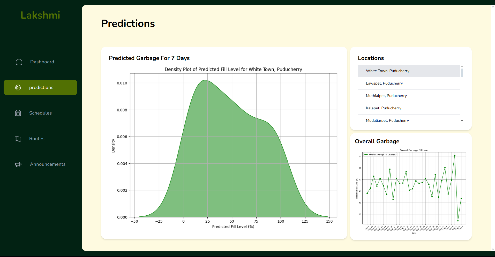
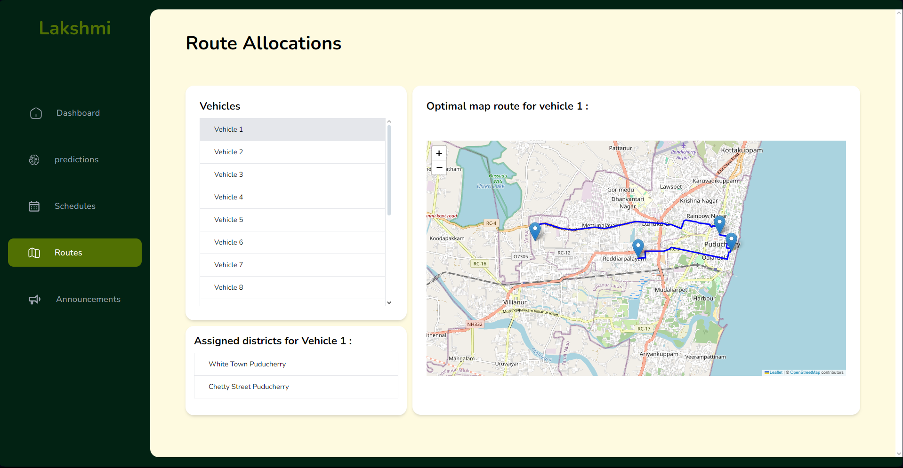

# Lakshmi - Smart Waste Management Admin Panel

## Overview

Lakshmi is an intelligent waste management application utilizing IoT devices and machine learning algorithms to optimize garbage collection. The admin panel is a React-based dashboard that enables city officials to monitor dustbin statuses, predict waste accumulation, and optimize collection routes efficiently.

## Features

### 📊 Live Dustbin Monitoring

- Displays real-time waste levels of dustbins across the city.
- Data is stored and continuously updated in the database.

### 🔮 Waste Prediction

- Predicts which dustbins will be filled within the next 24 hours or the next week.
- Forecasts the exact dates when dustbins will reach full capacity.

### 🚛 Optimal Route Planning

- Generates the most efficient collection route for garbage vehicles based on:
  - Vehicle capacity (e.g., 500 kg)
  - Current waste levels in dustbins
  - Destination (landfill/dumpster)
- Provides a visual route map for easy navigation.

### 📢 Announcements & Notifications

- Admins can send dynamic notifications and announcements to users.
- Helps inform users about waste collection schedules and any urgent updates.

### 🛠 Complaint Management

- Users can report overflowing dustbins via the mobile app.
- Complaints are received and managed from the admin panel.

### 📅 Event Pre-Intimation

- Users can notify officials in advance about events that may increase waste generation.
- Helps in better resource planning and allocation.

## Tech Stack

- **Frontend**: React.js
- **Styling**: Tailwind CSS / Material-UI / Custom CSS
- **Maps & Routing**: Google Maps API / OpenStreetMap API

## Installation & Setup

```bash
# Clone the repository
git clone https://github.com/Vickeysvibe/Lakshmi-smart-waste

# Navigate to the admin panel folder
cd Lakshmi-smart-waste

# Install dependencies
npm install

# Start the development server
npm start
```

## Screenshots





<!-- ## Demo Video
[](path-to-video/demo.mp4) -->

## Contribution

1. Fork the repository
2. Create a new branch (`feature-branch`)
3. Commit changes and push to your branch
4. Open a pull request
